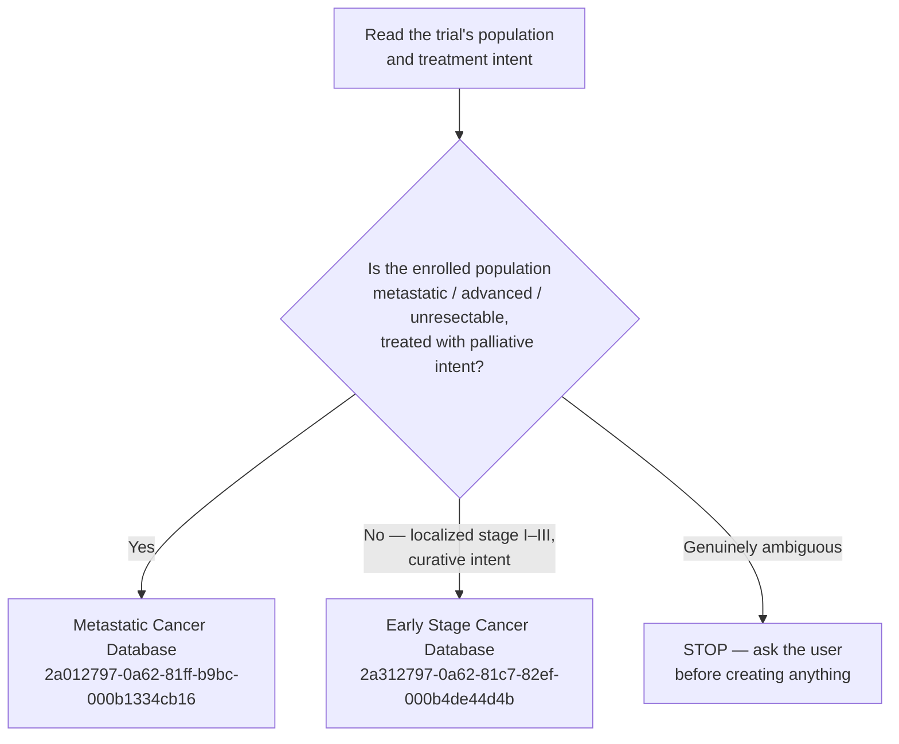

# Add Trial to the Notion Oncology Databases

Summarizes a clinical trial from reference attachments (PDF, slide deck, or images)
into a new page in **one of two** Notion databases, filling structured properties
concisely and writing a detailed narrative summary in the page body.

<span style="color:red">**The single most important step is choosing the right
database.**</span> The two databases have *different schemas*, so routing must
happen **before** any property mapping.

## Target databases

Both live under the "Oncology Database" page.

| Database | Data source id (parent for new pages) | Holds |
| --- | --- | --- |
| **Early Stage Cancer Database** | `2a312797-0a62-81c7-82ef-000b4de44d4b` | Localized disease treated with curative intent |
| **Metastatic Cancer Database** | `2a012797-0a62-81ff-b9bc-000b1334cb16` | Advanced/metastatic disease treated with palliative intent |

Title property in both: `Key Trials/Med`.

If a data source id no longer resolves, re-fetch it: search Notion for the
database name, fetch the result, and read the
`<data-source url="collection://...">` id from the response.

## Step 0 — Route to the correct database

Decide from the **trial population and treatment intent**, not from the drug or
the tumor type.



Routing signals:

| Signal | → Early Stage | → Metastatic |
| --- | --- | --- |
| Stage | I, II, III; resected or resectable; locally advanced with curative intent | IV; advanced; unresectable; recurrent/metastatic |
| Setting language | adjuvant, neoadjuvant, peri-operative, post-operative, definitive chemoRT, consolidation after definitive therapy | 1L / 2L / 3L, palliative, previously treated advanced disease |
| Primary endpoints | DFS, iDFS, EFS, RFS, recurrence, pCR, MRD/ctDNA clearance | PFS, OS, ORR, DoR |
| Response assessment | pCR — no measurable disease to respond | RECIST ORR / CR / PR / SD / DCR |

Ambiguous cases — **ask the user rather than guessing**: oligometastatic disease
treated radically, maintenance after definitive therapy, trials mixing localized
and metastatic cohorts, and "conversion" or "resectable metastatic" designs.

A mismatch is expensive to undo, so state the chosen database and the reason in
your first message, before writing anything.

## Schema reference — Early Stage Cancer Database

Data source: `2a312797-0a62-81c7-82ef-000b4de44d4b`

- `Phase` (multi-select): Meta, Ongoing, I, II, III, Retro
- `Timing` (**select**, single): Peri-OP, Neoadjuvant, Adjuvant
- `Cancer type` (**multi-select**): Other, Endometrial CA, Cerical CA, Ovary,
  Sarcoma, Skin, CRC, GC, Esophagus, UC, Pancreas, BTC, HCC, Breast, Lung, NPC,
  HEENT
- `Treatment` (multi-select): CDK4/6i, ET, ADC, ICI, RT, TKI, ChT, Anti-HER2,
  Others
- `Biomarker` (multi-select): HER2, ER/PR (HR), PD-L1, BRCA1/2, PIK3CA, ESR1,
  EGFR, ALK, MSI-H / dMMR, ctDNA

Text/number properties: `Year` (number), `Number` (number — enrolled N),
`Drug/Control`, `Patient population`, `DFS`, `PFS`, `OS`, `HR (95% CI)`,
`pCR (%)`, `Completion (%)`, `>= Gr. 3 TRAE`, `Key takeaway`.

The database has a page template, "Template for Early Cancer", which is the
canonical body layout for this DB (Primary endpoints table with RFS rows, then
Key secondary endpoints with mOS and pCR rate). Follow it in preference to the
metastatic example below where the two differ.

Notes specific to this database:
- There is **no** `Line` property and **no** ORR/CR/PR/SD/DCR properties.
- `Completion (%)` holds treatment completion or adherence rates.
- Use `"NA"` for endpoints the design cannot produce (e.g. `pCR (%)` = `"NA"` in
  an adjuvant post-resection trial).
- If the primary endpoint is recurrence rather than PFS, put it in `PFS` and
  label it explicitly (e.g. `**1° endpoint = CRC recurrence** (not PFS)`).

## Schema reference — Metastatic Cancer Database

Data source: `2a012797-0a62-81ff-b9bc-000b1334cb16`

- `Phase` (multi-select): Retro, Ongoing, I, II, III
- `Line` (multi-select): 1, 2, 3
- `Cancer type` (**multi-select**): GIST, Other, Endometrial CA, Cerical CA,
  Ovary, Sarcoma, Skin, CRC, GC, Esophagus, UC, Pancreas, BTC, HCC, Breast,
  Lung, NPC, HEENT
- `Treatment` (multi-select): NSAI, Anti-EGFR, SERD, CDK4/6i, Endocrine, RT,
  BsAb, Others, ADC, TKI, Anti-VEGF, ICI, ChT
- `Biomarker` (multi-select): BRCA, AKT, PIK3CA, HR, TP53, dMMR, RAF, RAS, RET,
  MET, ESR, ALK, ROS1, EGFR, HER2, KIT, PDGFRA, PD-L1

Text/number properties: `Year` (number), `Drug/Control`, `Patient population`,
`mOS (month)`, `PFS (month)`, `HR (95% CI)`, `ORR (%)`, `CR (%)`, `PR (%)`,
`SD (%)`, `DCR (%)`, `>= Gr. 3 TRAE`, `Key takeaway`.

## Property value conventions (both databases)

- Comparative arms as `"A vs. B"` (e.g. PFS `"16.9 vs. 9.3"`).
- Prefix outcome lines with a verdict marker, as existing entries do:
  `✅` met/positive, `⚠️` numerical trend or not formally significant,
  `❌` negative, `↔` non-inferior/equivalent.
- `HR (95% CI)` as `value (lower–upper); P=x` (use `P<0.0001` style when given),
  one endpoint per line, primary endpoint **bolded** first.
- Percentages as `"A% vs. B%"`, optionally with population/year in parentheses.
- `Key takeaway` is short and numbered, may use `<span color="red">...</span>`
  to highlight the key result.
- `Cancer type`: when a trial's population spans two organ labels, **tag both**.
  Gastro-oesophageal junction trials are the usual case — RAINBOW (gastric 80% /
  GEJ 20%) and CM-577 (oesophagus 58% / GEJ 42%) each carry `GC` + `Esophagus`.
  State the split in the page body so the dual tag is self-explaining.
- Multi-select: **reuse an existing option label whenever the data matches one.**
  Notion **rejects** unknown option values (`validation_error`) — it will not
  create them on the fly. If nothing fits, leave the property blank, flag it in
  your report, and offer to add the option to the data source schema. Do not
  silently force a wrong label.

## Page body structure

Reproduce this section structure (yellow background headers), written with a
**detailed** narrative — this is the one place to be thorough, in contrast to
the concise properties above:

```
# Trial Design {color="yellow_bg"}
---
- Design, N, randomization, stratification, endpoints (primary/secondary/exploratory)

# Patient Population {color="yellow_bg"}
---
- Population/eligibility, key exclusions, key demographics
(optional <details><summary>Detailed patient demographics</summary>...</details>)

# Treatment {color="yellow_bg"}
---
- Study group: dosing
- Control group: dosing

# Results {color="yellow_bg"}
---
## Key Efficacy Results {color="red_bg"}
---
**Always include this table — it is required for every trial entry.**
Rows cover **all** reported efficacy endpoints; omit a row only if the trial
genuinely did not report that endpoint. Use "—" for unreported/immature data,
not an empty cell.

- Metastatic trials: PFS, OS, ORR, CR, PR, SD, CBR, DOR, PFS2 …
- Early-stage trials: DFS, iDFS, EFS, RFS, recurrence, pCR, OS …

Formatting rules (follow the BOLERO-2 and KN-177 pages as canonical examples):
- Column headers: use the **actual arm names** (e.g., "Palbociclib + Fulvestrant"
  and "Placebo + Fulvestrant"), not generic labels.
- **Bold** the column header cells.
- Highlight each **primary endpoint row** with `color="yellow_bg"` on the `<tr>`;
  also bold the cell values in those rows.
- Include 95% CI for medians when reported (e.g., `6.9 mo (6.4–8.1)`).
- Include exact p-values; use `P<0.001` style.
- **Every `<tr>` must have the same number of `<td>` cells** — see Gotchas.

```
<table header-row="true" header-column="true">
<tr>
<td>**Endpoint**</td><td>**[Study arm]**</td><td>**[Control arm]**</td><td>**HR (95% CI); P**</td>
</tr>
<tr color="yellow_bg">
<td>**Median PFS (mo)**</td><td>16.9 (15.2–20.9)</td><td>9.3 (7.5–10.3)</td><td>**0.63 (0.52–0.77); P<0.001**</td>
</tr>
<tr color="yellow_bg">
<td>**Median OS (mo)**</td><td>46.0 (42.5–51.8)</td><td>37.3 (33.4–42.2)</td><td>0.81 (0.65–1.00); P=0.048</td>
</tr>
<tr>
<td>ORR (%)</td><td>42.1% (38.6–45.7)</td><td>34.7% (31.2–38.3)</td><td>—</td>
</tr>
<tr>
<td>CR (%)</td><td>3.2%</td><td>1.1%</td><td>—</td>
</tr>
<tr>
<td>PR (%)</td><td>38.9%</td><td>33.6%</td><td>—</td>
</tr>
<tr>
<td>SD (%)</td><td>48.7%</td><td>48.0%</td><td>—</td>
</tr>
<tr>
<td>CBR (%)</td><td>68.1%</td><td>40.5%</td><td>—</td>
</tr>
<tr>
<td>Median DOR (mo)</td><td>—</td><td>—</td><td>—</td>
</tr>
</table>
```

(optional `<columns>` with OS / PFS sub-sections for Kaplan-Meier figures/notes)
### Safety {color="yellow_bg"}
---
- Key safety findings, grade >=3 AEs, discontinuation rates

# Discussion/Notes {color="yellow_bg"}
---
- Interpretation, clinical context, how this changes practice

# Reference {color="yellow_bg"}
---
- Plain-text citation(s): authors, journal, year
```

Use Notion markdown conventions seen in existing entries: `**bold**` for
labels, `<span color="...">` for highlights, `<details>` for collapsible
sections, `<table>`/`<columns>` blocks as shown above.

## Workflow

1. **Get inputs**: trial name (title) from `$ARGUMENTS` or ask the user if
   missing; confirm the reference attachment(s) are available (PDF, slide
   deck, or images already in the conversation/filesystem).
2. **Extract source content**: read PDFs/images directly. If a `.pptx` can't
   be parsed directly, ask the user to export it to PDF or paste key slide
   screenshots instead — surface this as a limitation rather than failing
   silently.
3. **Route to the correct database** using Step 0 above. Read the population and
   treatment intent out of the source before deciding. **State the choice and
   the reason to the user.** If ambiguous, stop and ask.
4. **Check for an existing page — in BOTH databases**: search Notion for the
   trial name (`mcp__Notion__notion-search`), and confirm with a query against
   both data sources. If a page already exists in either database, **stop and
   inform the user** — show the existing page URL and ask whether to proceed
   (overwrite/update/move) or cancel. Do not create a duplicate silently.
5. **Fetch the target data source schema** before mapping
   (`mcp__Notion__notion-fetch` on the `collection://…` URL). Schemas drift —
   options get added and removed. Never map against the copy in this file
   without checking.
6. **Map extracted data** to the target schema, matching existing multi-select
   option labels wherever possible.
7. **Write the properties** map following the conventions above.
8. **Compose the page body** following the detailed structure above.
9. **Create the page** with `mcp__Notion__notion-create-pages`:
   - `parent`: `{"type": "data_source_id", "data_source_id": "<routed id>"}`
   - `icon`: `"📊"`
   - `properties`: the mapped properties (title under `Key Trials/Med`)
   - `content`: the composed body (do not repeat the title in content)
10. **Verify**: re-fetch the created page and check that every table kept all of
    its columns and that the properties landed as intended. Notion fails
    silently on some markup — see Gotchas.
11. **Report back**: share the new page URL, name the database it went into,
    list any property values that were inferred/uncertain or left blank so the
    user can spot-check against the source, and remind them that the original
    file must be attached manually in Notion under Reference — the Notion MCP
    tools have no file-upload capability.

## Correcting a mis-routed page

If a trial is already in the wrong database, **move it — do not recreate it**.
`mcp__Notion__notion-move-pages` with a `data_source_id` parent preserves the
page body, URL, and any manually attached files:

1. `mcp__Notion__notion-move-pages` → new parent = correct data source id.
2. Re-map every property to the new schema with
   `mcp__Notion__notion-update-page` (`command: "update_properties"`) — the
   schemas differ, so most values do **not** carry across the move.
3. Update any body text that referenced the old database's fields.
4. **Clean up the schema damage the move causes** — see the Gotchas entry
   below. Null out the moved page's stale values, then `DROP COLUMN` the
   injected properties and restore any property whose type was changed.
5. Verify with a query against both data sources that exactly one row exists,
   and re-fetch the destination schema to confirm it matches what it was.

## Gotchas

These are failure modes that have actually occurred — check for them.

- **Tool namespace**: the Notion MCP tools are `mcp__Notion__*` (e.g.
  `mcp__Notion__notion-create-pages`). Older drafts of this skill referenced
  `mcp__claude_ai_Notion__*`, which does not exist.
- **`colspan` / `rowspan` are not supported.** Notion does not error — it
  silently truncates the whole table to the *narrowest* row's cell count,
  dropping columns and their data. Give every `<tr>` an identical number of
  `<td>`s; put anything that would have spanned into a bullet below the table.
- **Multi-select options cannot be created on the fly.** Passing an unknown
  value returns `validation_error`. Leave blank and flag instead. To add one,
  use `mcp__Notion__notion-update-data-source` with
  `ALTER COLUMN "<prop>" SET MULTI_SELECT(...)` — and **list every existing
  option with its current color**, because the statement replaces the whole
  option set rather than appending to it. The DDL response may render the
  database's page templates as `Untitled`; that is a display artifact of the
  response, not damage — re-fetch the template page to confirm before
  "fixing" anything.
- **Moving a page between data sources pollutes the destination schema.**
  `notion-move-pages` carries the page's old properties with it and Notion
  silently creates matching columns in the destination — a move from the
  metastatic DB injected `Line`, `SD (%)`, `PR (%)` and `DCR (%)` into the
  early-stage DB, flipped `Cancer type` from `select` to `multi_select`, and
  renamed `DFS ` to `DFS`. **`Cancer type` being `multi_select` is now the
  intended state in both databases** (deliberately changed) — do not "restore"
  it to `select` as if it were move damage. Always re-fetch the
  destination schema after a move, diff it against what it was, and clean up.
  Before dropping an injected column, check no other row uses it:
  `SELECT COUNT("<prop>") FROM "collection://…"`.
- **`Cancer type` is `multi_select` in BOTH databases** — pass an array to
  each. It used to be a single `select` in the early-stage DB (pass a string),
  and earlier drafts of this skill said so; that is no longer true. The option
  sets still differ slightly: the metastatic DB has `GIST`, the early-stage DB
  does not. `Timing` is the only remaining single `select` (early-stage only).
- **`Treatment` is the property name in BOTH databases** (earlier drafts of
  this skill said the metastatic one was `Treatments` — it is not). The trap is
  that the two share a name but have **different option sets**: the early-stage
  DB has `ET` and `Anti-HER2`, the metastatic DB has `NSAI`, `Anti-EGFR`,
  `SERD`, `Endocrine`, `BsAb` and `Anti-VEGF`. Map against the routed
  database's own options.
- **Avoid `***text***`** — triple asterisks around a term (e.g. bolding a phrase
  that ends in an italicized gene name) round-trip badly. Write `**bold** *ital*`
  as separate runs.
- **No file upload.** The original PDF/slide deck must be attached by hand in
  Notion under the Reference section.
